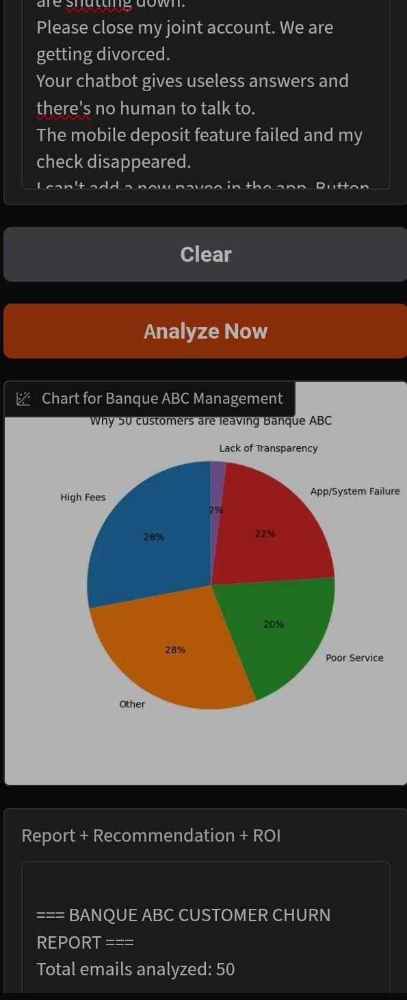
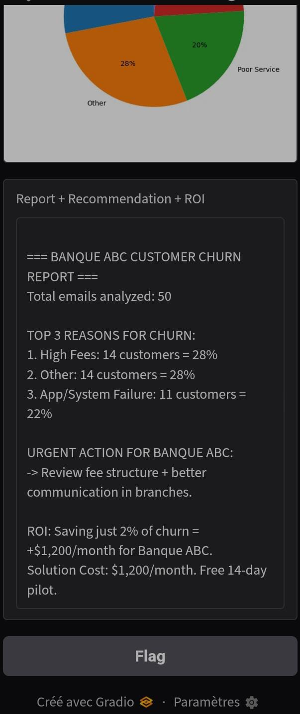

# Banque ABC - Customer Churn Detector

An AI-powered web application that analyzes customer churn emails and provides actionable business insights for bank management. Built with Gradio.

**Live Demo**: [Click here to run on colab https://colab.research.google.com/github/JeremieRaja/my_portefolio.github.io/blob/main/projects/churn-detector/churn_detector_abc.ipynb ]

## Screenshots

Click on any image to view full size.

### 1. Input Interface
Users can paste emails or use demo data.  

### 2. Churn Analysis Chart  
AI generates a pie chart showing why customers are leaving.  

### 3. AI Report + ROI  
Instant business report with recommendations and projected savings.  

## The Business Problem

Banque ABC is losing customers and doesn't know why. Agents spend hours reading complaint emails manually. This tool automates the process and quantifies the financial impact of churn.

## Key Features

- **AI Classification**: Automatically categorizes 100s of customer emails into churn reasons
- **Instant Dashboard**: Generates a pie chart showing the top reasons for customers leaving
- **Actionable Recommendations**: Suggests specific actions based on the #1 churn reason
- **ROI Calculation**: Estimates how much money the bank can save by fixing the main issue
- **1-Click UI**: Designed for non-technical managers to use on a tablet

## Tech Stack

- **Frontend/UI**: Gradio
- **Data Processing**: Pandas
- **Visualization**: Matplotlib
- **AI Logic**: Python Keyword-based NLP Classifier
